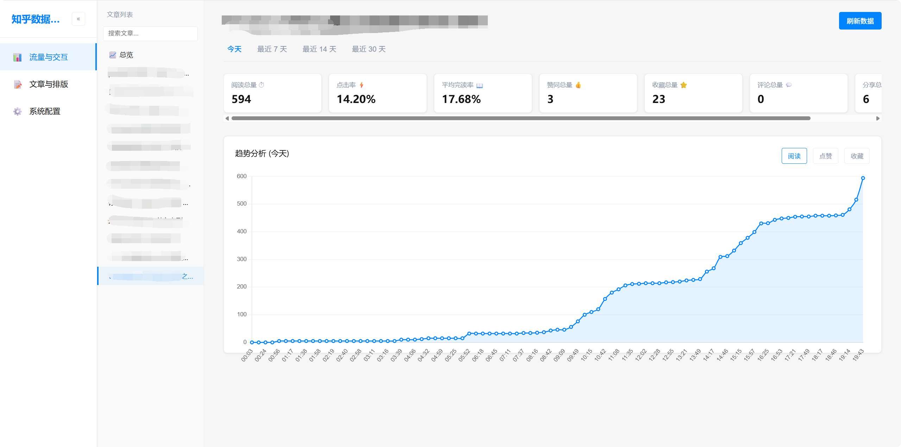
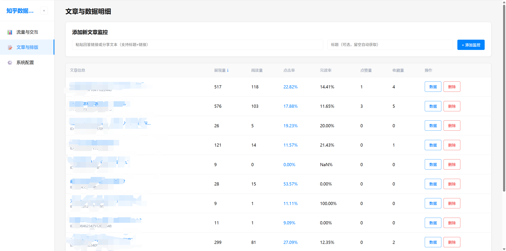

# 知乎数据监控中心

一个完全开源、免费的轻量级知乎创作者数据统计与监控工具。

## 开发初衷

其实主要是因为**知乎自己的创作后台有点不太够用**：

1. **无法汇总对比**：没办法把所有文章的数据汇总起来对比，想快速筛选最近哪些文章数据比较好，很难做到。
2. **关键数据缺失**：有些很关键的数据在官方后台是看不到的，比如**点击率**、**完读率**，还有**当天实时的增长情况**，而这些对做内容优化其实挺重要的。

所以我就干脆自己写了这个工具。目前用下来感觉还挺好用的，而且项目**完全开源、免费**，希望能帮到同样在做知乎创作的朋友。

## 核心亮点与功能

- 📈 **分钟级趋势**：追踪文章**每 10 分钟**的数据增长趋势，直观看到阅读量是怎么涨的。
- 🎯 **深度数据**：支持查看**点击率、完读率**等关键完播指标。
- 🔄 **多维视图**：支持自由切换不同的数据视图（日内实时趋势 / 按天多日趋势）。
- 📊 **统一管理**：添加文章后可以**统一管理和排序**，方便同时观察多篇文章的数据表现。
- ⚙️ **灵活配置**：可以在线自定义抓取间隔时间、Cookie 等参数。

## 截图





## 技术栈

| 组件 | 技术 |
|------|------|
| 后端 | Python + Flask |
| 前端 | HTML + CSS + Chart.js |
| 数据库 | SQLite |
| 数据源 | 知乎创作者中心 API |

## 快速开始

### 1. 安装依赖

```bash
pip install flask requests
```

### 2. 启动

```bash
python main.py
```

浏览器会自动打开 `http://localhost:5050`。

### 3. 配置

首次使用需在「系统配置」页面填入：

- **知乎 Cookie**：登录知乎后从浏览器 DevTools 复制
- **x-zse-96**：知乎 API 签名参数

### 4. 添加文章

在「文章与排版」页面添加要监控的文章，填入文章标题和 Token（URL 中的数字 ID）。

## 项目结构

```
zhihu-data/
├── app/
│   ├── repos.py           # 数据访问与 SQL
│   └── services.py        # 业务逻辑（抓取/校验/调度/统计）
├── static/
│   ├── css/app.css        # 前端样式
│   └── js/app.js          # 前端交互逻辑
├── templates/
│   └── index.html         # 前端结构模板
├── main.py                # Flask 路由与启动入口
├── zhihu_data.db          # SQLite 数据库（自动创建）
└── docs/refactor_report.md
```

## API

| 方法 | 路径 | 说明 |
|------|------|------|
| GET | `/api/stats/summary?date=&token=` | 数据汇总（支持按文章筛选） |
| GET | `/api/stats/trend?days=&token=` | 趋势数据（折线图） |
| GET | `/api/articles` | 获取监控文章列表 |
| POST | `/api/articles` | 添加文章 |
| DELETE | `/api/articles/<token>` | 删除文章 |
| GET | `/api/config` | 获取配置 |
| PUT | `/api/config` | 更新配置 |
